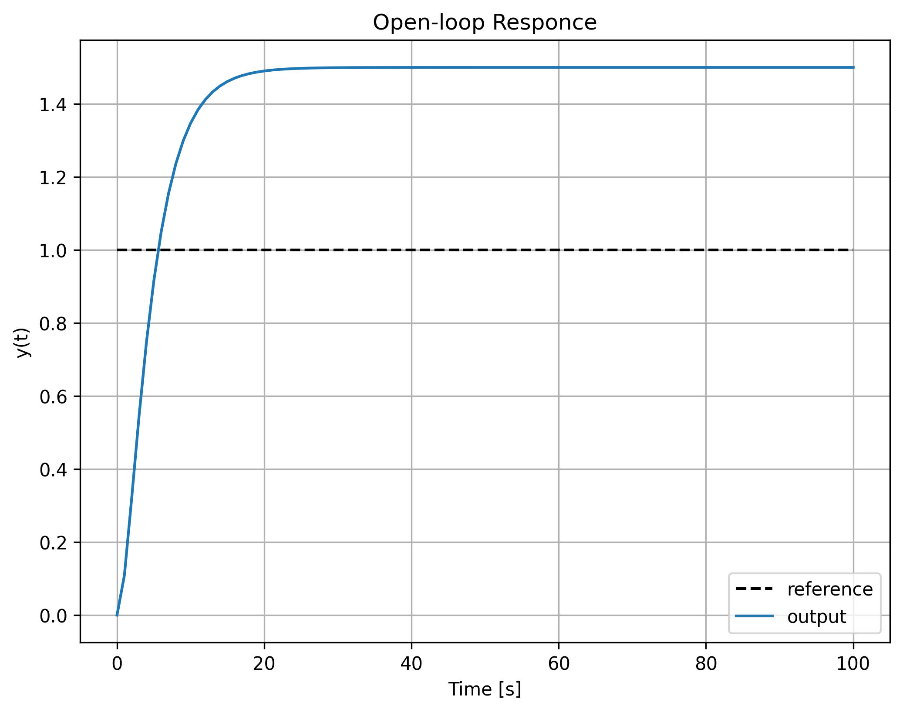
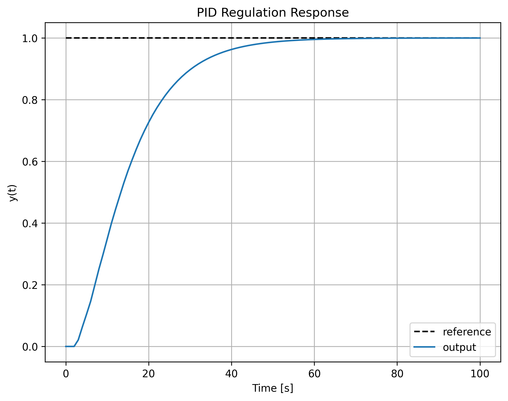
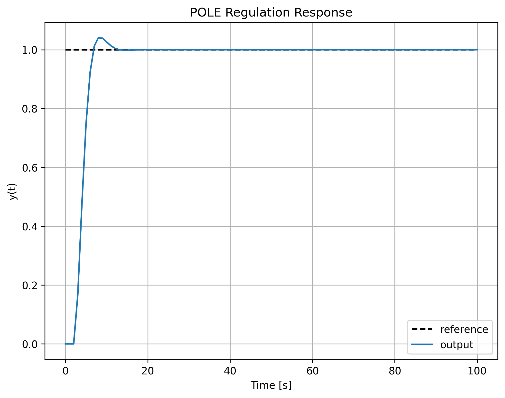
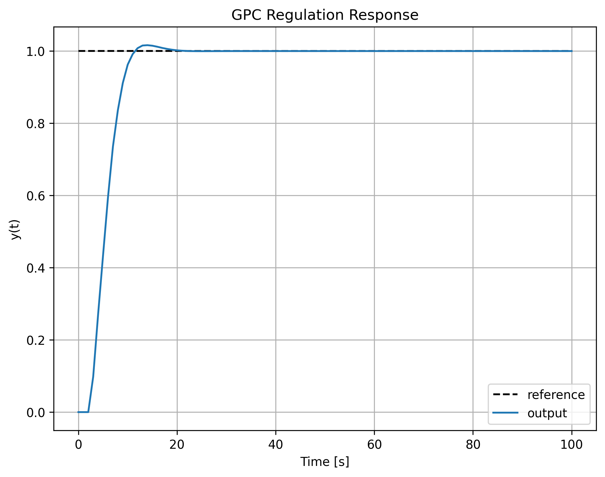
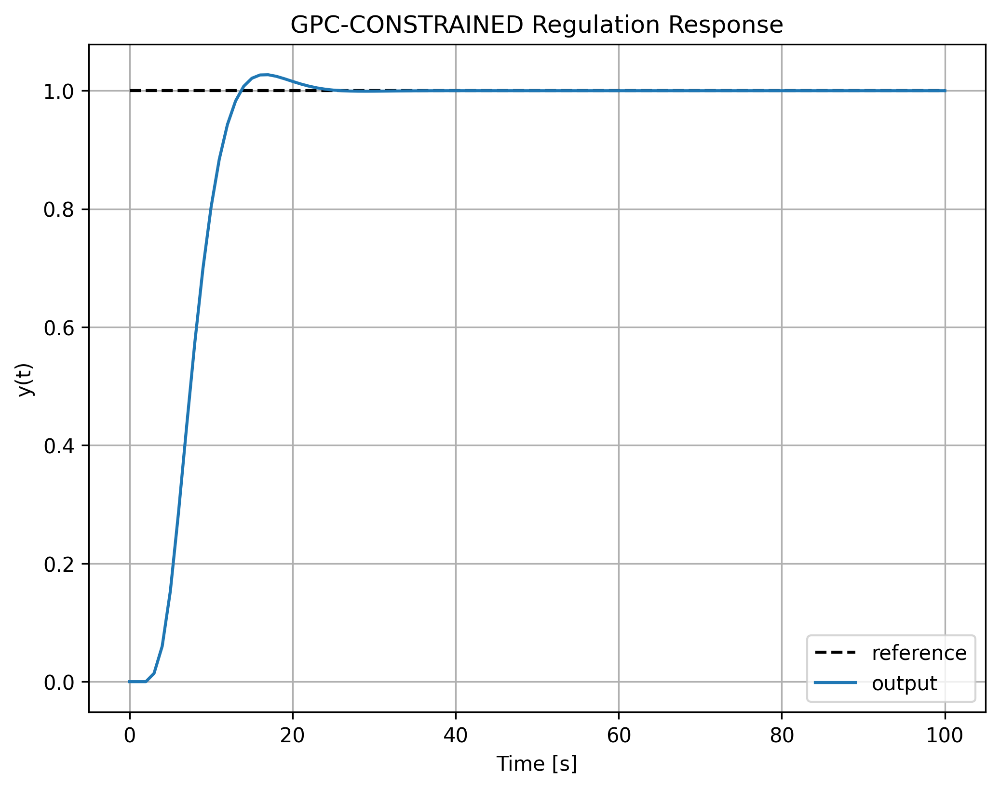

# Predictive Control

Learning implementation of classic and predictive control algorithms.

## Program Flow

1. `argument_parser()` selects controller via CLI (`null` / `pid` / `pole` / `gpc` / `gpc-constrained`)
2. `main()` constructs a continuous plant $H(s) = \frac{1.5}{5s^2 + 5s + 1}$, discretises it (ZOH), and instantiates the regulator
3. `simulate_plant()` iterates the difference equation, calling `regulator.regulate()` at each step
4. `plot_responce()` saves or shows the step response for the tested controller or open-loop

## Implemented Controllers

### Open-Loop (`null`)

No controller; just the plant step response. Used as a baseline.

### PID (`pid.py`)

Velocity (incremental) form of a discrete PID:

$$
\begin{aligned}
q_0 &= -r_0 \left(1 + \frac{T}{2T_i} + \frac{T_d}{T}\right) \\
q_1 &= r_0 \left(1 - \frac{T}{2T_i} + 2\frac{T_d}{T}\right) \\
q_2 &= -r_0 \frac{T_d}{T} \\
u_k &= u_{k-1} - (q_0+q_1+q_2)\, r_k + q_0\, y_k + q_1\, y_{k-1} + q_2\, y_{k-2}
\end{aligned}
$$

### Pole-Placement (RST) (`ppc.py`)

Solves the Diophantine equation to place closed-loop poles arbitrarily:

$$
A(z) \cdot P(z) + B(z) \cdot Q(z) = D(z)
$$

- $A(z)$, $B(z)$ — plant denominator and numerator
- $D(z)$ — desired closed-loop polynomial (mapped from continuous poles $s_i \to e^{s_i T}$)
- $P(z)$, $Q(z)$ — unknown controller polynomials solved via least-squares

Control law (RST structure):

$$
u_k = R \cdot r_k - \sum_{i=0}^{n-1} q_i \cdot y_{k-i} - \sum_{i=1}^{n-1} p_i \cdot u_{k-i}
$$

where $R = D(1) / B(1)$ ensures zero steady-state error.

### GPC (`gpc.py`)

Generalized Predictive Controller using the CARIMA model.

The plant model is augmented with an integrator:

$$
\tilde{A}(z) = A(z)(1 - z^{-1})
$$

Prediction over horizon $N$:

$$
\mathbf{y} = G \, \Delta\mathbf{u} + \mathbf{f}
$$

- $G$ — lower-triangular step-response matrix ($G = \tilde{A}^{-1} B$)
- $\mathbf{f}$ — free response (predicted from past inputs/outputs)

Quadratic cost:

$$
J = (\mathbf{w} - \mathbf{y})^T (\mathbf{w} - \mathbf{y}) + \lambda \, \Delta\mathbf{u}^T \Delta\mathbf{u}
$$

#### Unconstrained

Closed-form analytical solution:

$$
\Delta\mathbf{u} = (G^T G + \lambda I)^{-1} G^T (\mathbf{w} - \mathbf{f})
$$

Only the first increment $\Delta u_k$ is applied (receding horizon).

#### With Constraints

Input constraints $u_{\min} \le u_k \le u_{\max}$ are handled by reformulating as a quadratic program (QP) over $\Delta\mathbf{u}$:

$$
\begin{aligned}
\min_{\Delta\mathbf{u}} \quad & \frac{1}{2} \Delta\mathbf{u}^T H \Delta\mathbf{u} + \mathbf{c}^T \Delta\mathbf{u} \\
\text{s.t.} \quad & \begin{bmatrix} T_l \\ -T_l \end{bmatrix} \Delta\mathbf{u} \le \begin{bmatrix} \mathbf{u}_{\max} - u_{k-1} \\ \mathbf{u}_{k-1} - \mathbf{u}_{\min} \end{bmatrix}
\end{aligned}
$$

where $H = G^T G + \lambda I$, $\mathbf{c} = -G^T(\mathbf{w} - \mathbf{f})$, and $T_l$ is the lower-triangular sum matrix.

The QP is solved via **Hildreth's algorithm** — an iterative row-action method that updates dual variables and clips them at zero, recovering the primal solution from the dual:

$$
d_i^{(t+1)} = \max\!\left(0,\, -\frac{1}{M_{ii}}\Big(\sum_{j} M_{ij} d_j^{(t)} - M_{ii} d_i^{(t)} + \frac{1}{2} h_i\Big)\right)
$$

where $M = \frac{1}{4} C H^{-1} C^T$ and $\mathbf{h} = \frac{1}{2} C H^{-1} \mathbf{c} + \mathbf{b}$.

## Simulation Results

| Controller | Closed-Loop Step Response |
|:----------:|:-------------------------:|
| Open-loop (no control) |  |
| PID |  |
| Pole-Placement |  |
| GPC (unconstrained) |  |
| GPC (constrained) |  |

## Usage

```bash
make run-pid          # PID
make run-pole         # Pole-placement
make run-gpc          # GPC (unconstrained)
make run-gpc-con      # GPC with input constraints [0, 10]
make run-open         # Open-loop (null)

# to save plot to .png:
make run-{controller} ARGS="--mode=save"
```

Or manually:

```bash
python main.py pid
python main.py gpc
python main.py gpc-constrained --mode save
python main.py null
```

The plant is $1.5 / (5s^2 + 5s + 1)$ with $T_s = 1$ s.

## Dependencies

- `numpy`, `scipy`, `matplotlib`
